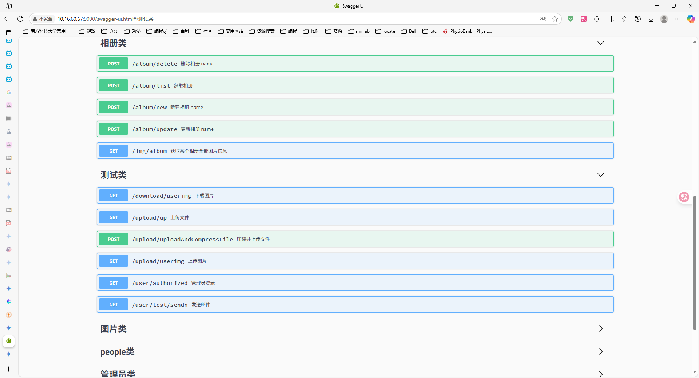
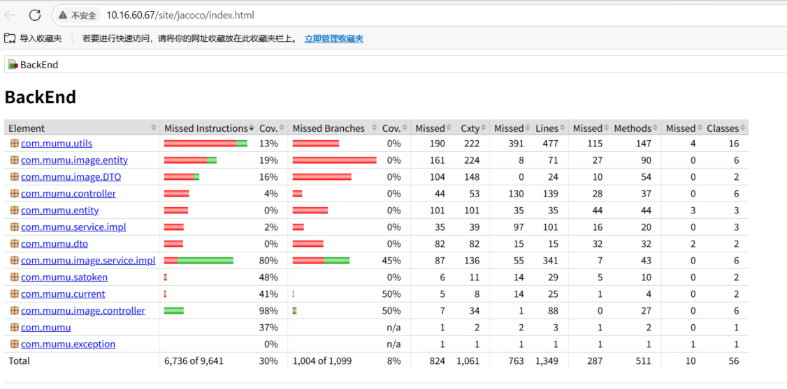
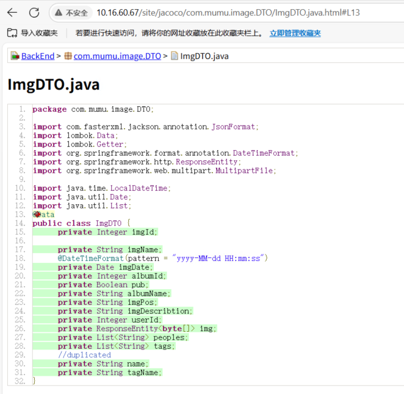

# OOAD-BACKEND-PROJECT

# 在更新服务器版本前请务必在本地进行测试！！！

权限管理文档：https://sa-token.cc/doc.html

多表联查文档：https://mybatis-plus-join.github.io

注意！！！浏览器在使用signin登录后会记录cookie，维持登录状态，在使用signout登出后才会忘记登陆状态

接口调用参考：http://10.16.60.67:9090/swagger-ui.html#/

测试代码覆盖率参考：http://10.16.60.67/site/jacoco/index.html

DTO类等覆盖率较低是由于引入@data注解，实际基本全部覆盖，且实际请求方法为controller中的方法，此部分完全覆盖

java后端数据统计：

| Lines of Code          | 3138 |
| ---------------------- | ---- |
| Number of source files | 82   |
| Cyclomatic complexity  | 1061 |
| Number of dependencies | 26   |

