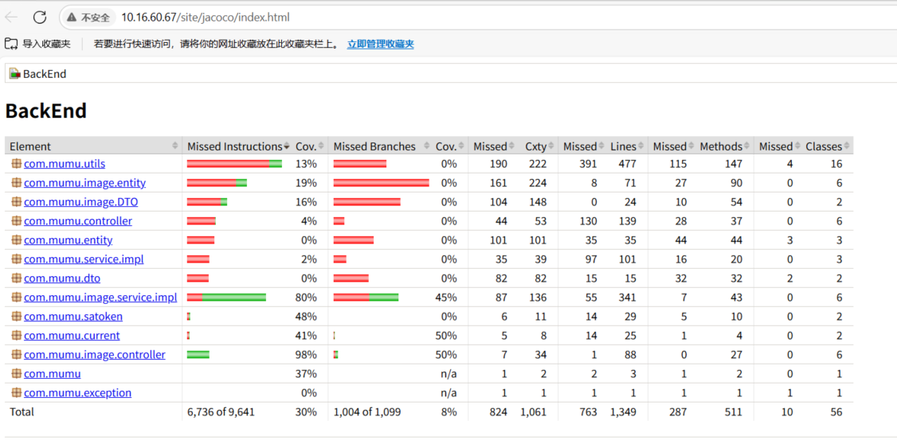

## Metrics (1 point)

| Lines of Code          | 3138 |
| ---------------------- | ---- |
| Number of source files | 82   |
| Cyclomatic complexity  | 1061 |
| Number of dependencies | 26   |

## developer api documentation：http://10.16.60.67:9090/swagger-ui.html#/


## Tests for backend

Technology: jcoco

Test coverage report:http://10.16.60.67/site/jacoco/index.html



The low coverage for DTO classes and similar is due to the `@Data` annotation; in reality, they are almost fully covered. Furthermore, the actual request methods are within the controller methods, which are completely covered.

[](https://github.com/sustech-cs304/team-project-25spring-9/blob/backend-spring/img/img_2.png)

[](https://github.com/sustech-cs304/team-project-25spring-9/blob/backend-spring/img/img_3.png)


## Deployment

### Technology/Tools/Frameworks/Approaches Used for Containerization

Our project leverages **Docker** for individual service containerization and **Docker Compose** for orchestrating and managing the multi-container application. This approach offers several benefits:

- **Isolation:** Each service (backend, frontend, image processing, database, object storage) runs in its own isolated container, preventing conflicts and ensuring consistent environments.
- **Portability:** The containerized application can be easily deployed across different environments (development, testing, production) without compatibility issues.
- **Scalability:** Individual services can be scaled independently as needed.
- **Simplified Deployment:** Docker Compose streamlines the deployment process by defining all services, networks, and volumes in a single configuration file.

The key technologies and tools used are:

- **Docker Engine:** The core platform for building, running, and managing containers.
- **Docker Compose:** A tool for defining and running multi-container Docker applications.
- **Dockerfiles:** Used to define the build steps for each custom service image (backend, frontend, image processing).
- **Spring Boot:** Framework for the backend application.
- **Vue.js/Vite:** Framework for the frontend application.
- **Python:** Used for the `Process_Image` application.
- **MySQL:** Relational database.
- **MinIO:** S3-compatible object storage.

### Script or Related Artifacts Used for Containerization

The primary artifact for containerization is the `docker-compose.yml` file, which defines the entire multi-service application. Individual Dockerfiles within the `backend`, `frontend`, and `Process_Image` directories are used to build the specific images for those services.

Here's the `docker-compose.yml` content:

```dockerfile
version: '3.8'

services:
  backend-app:
    build: ./backend
    container_name: my-backend-app-together-1
    ports:
      - "9090:9091"
    environment:
      - SPRING_PROFILES_ACTIVE=docker
    restart: unless-stopped

  web:
    build:
      context: ./frontend
      dockerfile: Dockerfile
      target: production
    image: album:latest
    ports:
      - "0.0.0.0:5173:5173"
    restart: unless-stopped
    container_name: my-frontend-app-1

  process-image-app:
    build: ./Process_Image
    ports:
      - "8123:8123"
    volumes:
      - ./Process_Image:/app
    environment:
      - PYTHONUNBUFFERED=1
    container_name: my-process-image-app-1
    restart: unless-stopped

  mysql:
    image: mysql:latest
    container_name: software_eng_mysql_together-1
    restart: always
    environment:
      MYSQL_ROOT_PASSWORD: software_eng_pss
      MYSQL_DATABASE: software_eng
      MYSQL_USER: root_1
      MYSQL_PASSWORD: software_eng_pss
    ports:
      - "3306:3306"
    volumes:
      - /var/lib/mysql/software_eng_data:/var/lib/mysql
      - ./backend/table.sql:/docker-entrypoint-initdb.d/table.sql

  minio:
    image: minio/minio:latest
    container_name: software_eng_minio_together-1
    restart: always
    environment:
      MINIO_ROOT_USER: root
      MINIO_ROOT_PASSWORD: software_eng_pss
    ports:
      - "9000:9000"
      - "9001:9001"
    volumes:
      - /var/lib/minio/data:/data
    command: server /data --console-address ":9001"

  createbuckets:
    image: minio/mc
    container_name: software_eng_minio_createbuckets-1
    depends_on:
      - minio
    entrypoint: >
      /bin/sh -c "
      echo 'Waiting for MinIO to be ready...';
      sleep 10;
      echo 'Setting up MinIO alias...';
      /usr/bin/mc alias set local http://minio:9000 root software_eng_pss;
      echo 'Creating buckets...';
      /usr/bin/mc mb local/softwareeng;
      /usr/bin/mc anonymous set public local/softwareeng/;
      /usr/bin/mc mb local/softwareeng/user-img;
      /usr/bin/mc mb local/softwareeng/builder-img;
      /usr/bin/mc mb local/softwareeng/comment-img;
      /usr/bin/mc mb local/softwareeng/restaurant-img;
      /usr/bin/mc mb local/softwareeng/food-img;
      /usr/bin/mc mb local/softwareeng/bus-json;
      /usr/bin/mc mb local/softwareeng/commodity-img;
      /usr/bin/mc mb local/softwareeng/upload-img;
      echo 'Bucket creation script finished.';
      exit 0;
      "
```


### Proof of Successful Containerization

Containerization result:


The proof video of deployment: http://10.16.60.67/site/docker-build-speedup.mp4

