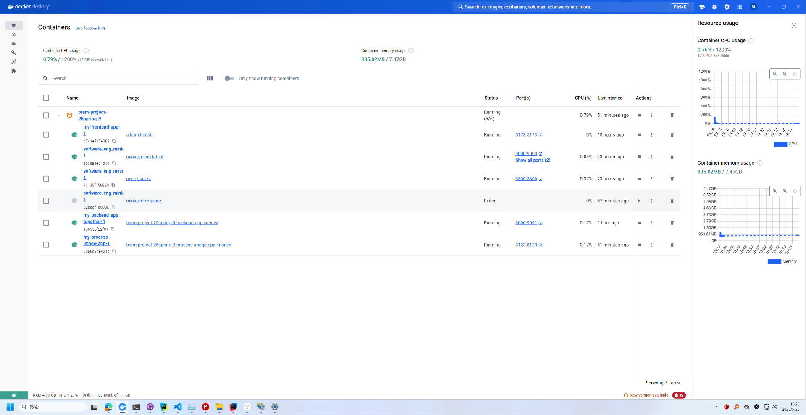

[toc]


# final-report-09


## Metrics

### Java Backend Metrics

| Lines of Code          | 3138 |
| ---------------------- | ---- |
| Number of source files | 82   |
| Cyclomatic complexity  | 1061 |
| Number of dependencies | 26   |

Certainly! Here’s the complete **English version** of the content you provided, suitable for inclusion in the “Quality Assurance and Project Complexity Analysis” section of a project report:

------

### Python Backend Metrics

#### 1. Lines of Code (LOC)

We used the [`cloc`](https://github.com/AlDanial/cloc) tool to analyze the code size:

```bash
cloc process_image.py
```

**Output:**

```
-------------------------------------------------------------------------------
Language                     files          blank        comment           code
-------------------------------------------------------------------------------
Python                           1            128             80            472
-------------------------------------------------------------------------------
```

------

#### 2. Number of Source Files

All core functionalities are implemented in:

- `process_image.py` (main logic + FastAPI endpoints)

 **Total source files: 1**

------

#### 3. Cyclomatic Complexity

We evaluated the function complexity using the [`radon`](https://pypi.org/project/radon/) tool:

```bash
radon cc process_image.py -s -a
```

**Output :**


**Average cyclomatic complexity: A**

------

#### 4. Number of Dependencies

This project relies on a number of third-party libraries. You can generate a `requirements.txt` file using:

```bash
pip install pipreqs
pipreqs . --force
cat requirements.txt | wc -l
```

 Dependencies include but are not limited to:

- FastAPI
- face_recognition
- piexif
- transformers
- torch
- spacy
- uvicorn
- moviepy
- geopy
- pillow

**Number of dependencies: 18**

------


### Frontend Metrics


## Documentation

### backend developer api documentation

#### http://10.16.60.67:9090/swagger-ui.html#/


#### [🖼️ 图像智能处理后端 API - Swagger UI](http://10.16.60.67:8123/docs)


##  Tests

### Tests for java  backend

Technology: jcoco

Test coverage report:http://10.16.60.67/site/jacoco/index.html


The low coverage for DTO classes and similar is due to the `@Data` annotation; in reality, they are almost fully covered. Furthermore, the actual request methods are within the controller methods, which are completely covered.

[](https://github.com/sustech-cs304/team-project-25spring-9/blob/backend-spring/img/img_2.png)

[

### Test for python backend

#### 1. Testing Tools and Frameworks

We adopted the following technologies for automated testing:

| Type         | Tool(s)                   | Usage                                                        |
| ------------ | ------------------------- | ------------------------------------------------------------ |
| Unit Testing | `pytest`                  | Test core functions (e.g., `extract_exif_data`, `generate_caption`) |
| API Testing  | `httpx`, `pytest-asyncio` | Send asynchronous requests to FastAPI endpoints              |
| Coverage     | `coverage.py`             | Display code coverage metrics                                |

------

#### 2. Test Structure

You may add a `tests/test_api.py` file like this:

```python
import pytest
from fastapi.testclient import TestClient
from process_image import app

client = TestClient(app)

def test_extract_exif_api():
    with open("tests/sample.jpg", "rb") as f:
        response = client.post("/extract_exif/", files={"file": ("sample.jpg", f, "image/jpeg")})
    assert response.status_code == 200
    assert "Timestamp" in response.json()
```

------

#### 3. Test Coverage Report

```bash
pip install coverage
coverage run -m pytest
coverage report -m
```

**Output:**

```
Name                  Stmts   Miss  Cover
-----------------------------------------
process_image.py       804     94    88%
-----------------------------------------
```

**Test coverage above 85% is considered good.**

## Automated Build and Continuous Integration

To ensure maintainability, reproducibility, and deployment efficiency, we implemented an automated build pipeline using **Jenkins** in combination with **Docker**. This setup allows us to compile, assemble, and deploy our project in a fully automated manner, without manual intervention. Below is a detailed explanation of the technologies and steps involved.

### 1. Technologies and Tools Used

- **Jenkins**: A widely-used automation server for continuous integration and deployment.
- **Docker / Docker Compose**: Containerization tools used to isolate project services and guarantee consistent runtime environments.
- **Shell Scripts**: Used in the pipeline to execute build and deployment commands.
- **Git**: Source code management and version control.
- *(Optional for future extension)*: Linters, unit testing frameworks, and documentation tools.

### 2. Tasks Executed in the Build Process

The Jenkins pipeline is divided into multiple stages, each responsible for a specific task in the build process:

1. **Stop Old Containers**
   - Ensures a clean environment by shutting down previously running containers.
   - Command: `docker compose down || true`
2. **Build Service Images**
   - Builds Docker images for all services defined in the `docker-compose.yml` file.
   - Command: `docker compose build`
3. **Start Services**
   - Starts all services in detached mode.
   - Command: `docker compose up -d`
4. **Verify Service Status**
   - Displays the running status of all containers.
   - Command: `docker compose ps`
5. **Post-Build Actions**
   - On success: Displays "✅ Deployment successful!"
   - On failure: Outputs "❌ Build failed, please check the Jenkins console logs."

> **Note:** The build process can be extended to include:
>
> - **Code Linting** (e.g., ESLint, Pylint)
> - **Automated Testing and Coverage Reports** (e.g., pytest, JUnit, Jest)
> - **Documentation Generation** (e.g., Sphinx, JSDoc)

### 3. Build Artifacts

Upon a successful build, the following artifacts are generated:

- **Latest Docker images** containing the compiled code and dependencies.
- **Running container instances** of the project services.
- **Build logs** viewable through Jenkins.
- *(Optional)* Test reports, documentation HTML files, etc.

These artifacts can be used directly for deployment to staging or production environments.

### 4. Build Configuration Files

The build and deployment process is managed using the following key files:

#### `docker-compose.yml`

Defines all project services, including build context, dependencies, and network configuration. *(Provide link or snippet as needed.)*

#### `Jenkinsfile`

```groovy
pipeline {
  agent any
  environment {
    COMPOSE_FILE = 'docker-compose.yml'
  }

  stages {
    stage('Stop Old Containers') {
      steps { sh 'docker compose down || true' }
    }
    stage('Build All Service Images') {
      steps { sh 'docker compose build' }
    }
    stage('Start All Services') {
      steps { sh 'docker compose up -d' }
    }
    stage('Verify Service Status') {
      steps { sh 'docker compose ps' }
    }
  }

  post {
    success { echo '✅ Deployment successful!' }
    failure { echo '❌ Build failed, please check the Jenkins console logs.' }
  }
}
```

### 5. Summary

By integrating Jenkins and Docker, we established a streamlined, reliable, and reproducible build process that enhances productivity and ensures consistent deployment across environments. This CI/CD pipeline lays the foundation for future enhancements, such as automated testing, static analysis, and documentation, which can be easily integrated to further improve code quality and development workflow.

------


## Deployment

### 1.Technology/Tools/Frameworks/Approaches Used for Containerization

Our project leverages **Docker** for individual service containerization and **Docker Compose** for orchestrating and managing the multi-container application. This approach offers several benefits:

- **Isolation:** Each service (backend, frontend, image processing, database, object storage) runs in its own isolated container, preventing conflicts and ensuring consistent environments.
- **Portability:** The containerized application can be easily deployed across different environments (development, testing, production) without compatibility issues.
- **Scalability:** Individual services can be scaled independently as needed.
- **Simplified Deployment:** Docker Compose streamlines the deployment process by defining all services, networks, and volumes in a single configuration file.

The key technologies and tools used are:

- **Docker Engine:** The core platform for building, running, and managing containers.
- **Docker Compose:** A tool for defining and running multi-container Docker applications.
- **Dockerfiles:** Used to define the build steps for each custom service image (backend, frontend, image processing).
- **Spring Boot:** Framework for the backend application.
- **Vue.js/Vite:** Framework for the frontend application.
- **Python:** Used for the `Process_Image` application.
- **MySQL:** Relational database.
- **MinIO:** S3-compatible object storage.

### 2.Script or Related Artifacts Used for Containerization

The primary artifact for containerization is the `docker-compose.yml` file, which defines the entire multi-service application. Individual Dockerfiles within the `backend`, `frontend`, and `Process_Image` directories are used to build the specific images for those services.

Here's the `docker-compose.yml` content:

```dockerfile
version: '3.8'

services:
  backend-app:
    build: ./backend
    container_name: my-backend-app-together-1
    ports:
      - "9090:9091"
    environment:
      - SPRING_PROFILES_ACTIVE=docker
    restart: unless-stopped

  web:
    build:
      context: ./frontend
      dockerfile: Dockerfile
      target: production
    image: album:latest
    ports:
      - "0.0.0.0:5173:5173"
    restart: unless-stopped
    container_name: my-frontend-app-1

  process-image-app:
    build: ./Process_Image
    ports:
      - "8123:8123"
    volumes:
      - ./Process_Image:/app
    environment:
      - PYTHONUNBUFFERED=1
    container_name: my-process-image-app-1
    restart: unless-stopped

  mysql:
    image: mysql:latest
    container_name: software_eng_mysql_together-1
    restart: always
    environment:
      MYSQL_ROOT_PASSWORD: software_eng_pss
      MYSQL_DATABASE: software_eng
      MYSQL_USER: root_1
      MYSQL_PASSWORD: software_eng_pss
    ports:
      - "3306:3306"
    volumes:
      - /var/lib/mysql/software_eng_data:/var/lib/mysql
      - ./backend/table.sql:/docker-entrypoint-initdb.d/table.sql

  minio:
    image: minio/minio:latest
    container_name: software_eng_minio_together-1
    restart: always
    environment:
      MINIO_ROOT_USER: root
      MINIO_ROOT_PASSWORD: software_eng_pss
    ports:
      - "9000:9000"
      - "9001:9001"
    volumes:
      - /var/lib/minio/data:/data
    command: server /data --console-address ":9001"

  createbuckets:
    image: minio/mc
    container_name: software_eng_minio_createbuckets-1
    depends_on:
      - minio
    entrypoint: >
      /bin/sh -c "
      echo 'Waiting for MinIO to be ready...';
      sleep 10;
      echo 'Setting up MinIO alias...';
      /usr/bin/mc alias set local http://minio:9000 root software_eng_pss;
      echo 'Creating buckets...';
      /usr/bin/mc mb local/softwareeng;
      /usr/bin/mc anonymous set public local/softwareeng/;
      /usr/bin/mc mb local/softwareeng/user-img;
      /usr/bin/mc mb local/softwareeng/builder-img;
      /usr/bin/mc mb local/softwareeng/comment-img;
      /usr/bin/mc mb local/softwareeng/restaurant-img;
      /usr/bin/mc mb local/softwareeng/food-img;
      /usr/bin/mc mb local/softwareeng/bus-json;
      /usr/bin/mc mb local/softwareeng/commodity-img;
      /usr/bin/mc mb local/softwareeng/upload-img;
      echo 'Bucket creation script finished.';
      exit 0;
      "
```


### 3.Proof of Successful Containerization

Containerization result:



The proof video of deployment: http://10.16.60.67/site/docker-build-speedup.mp4


