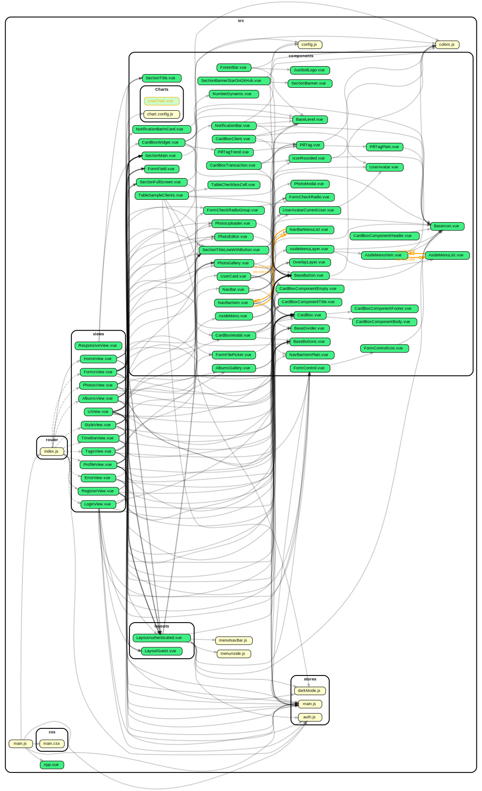
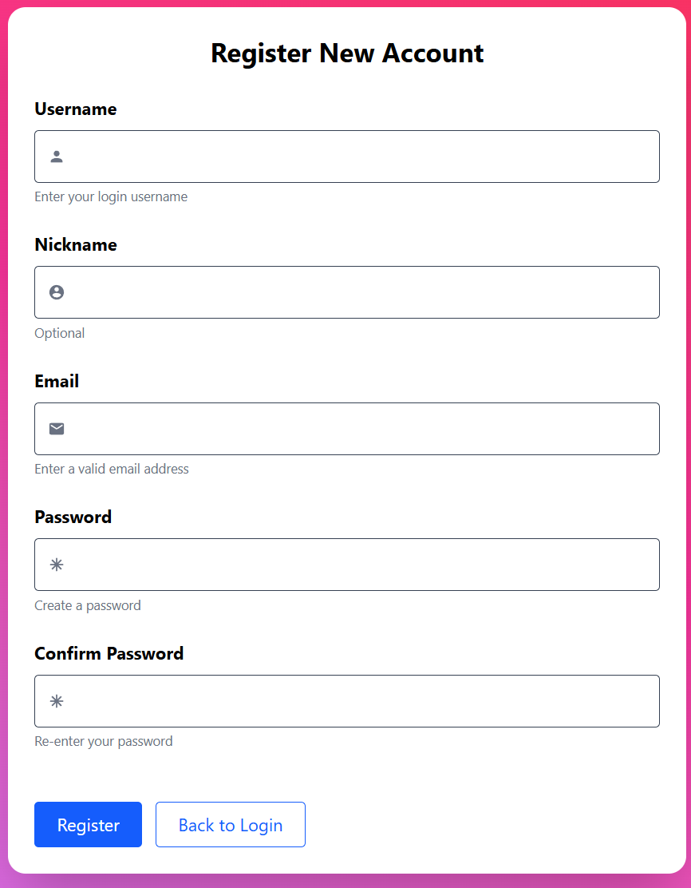
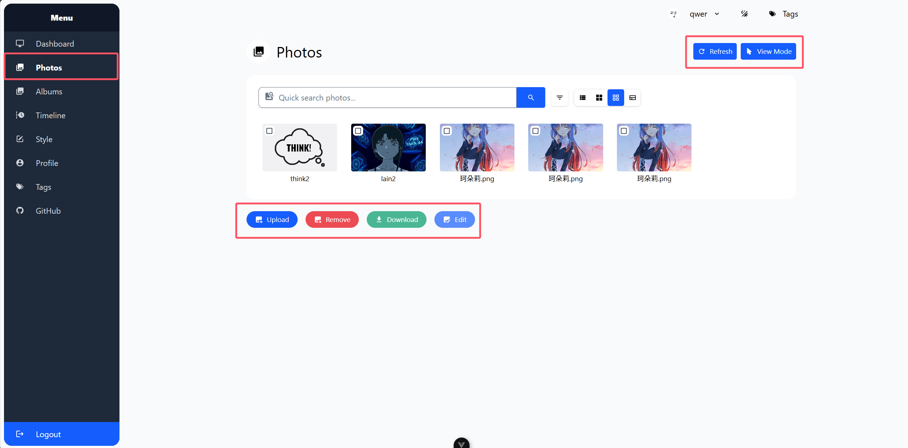
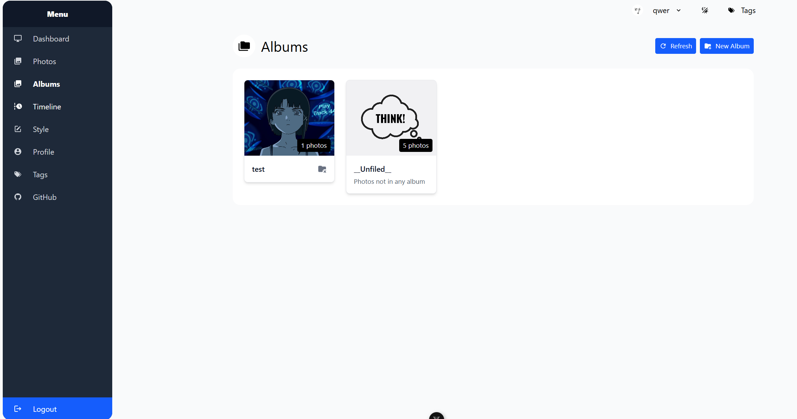
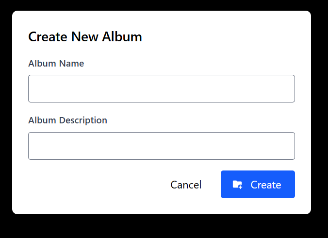
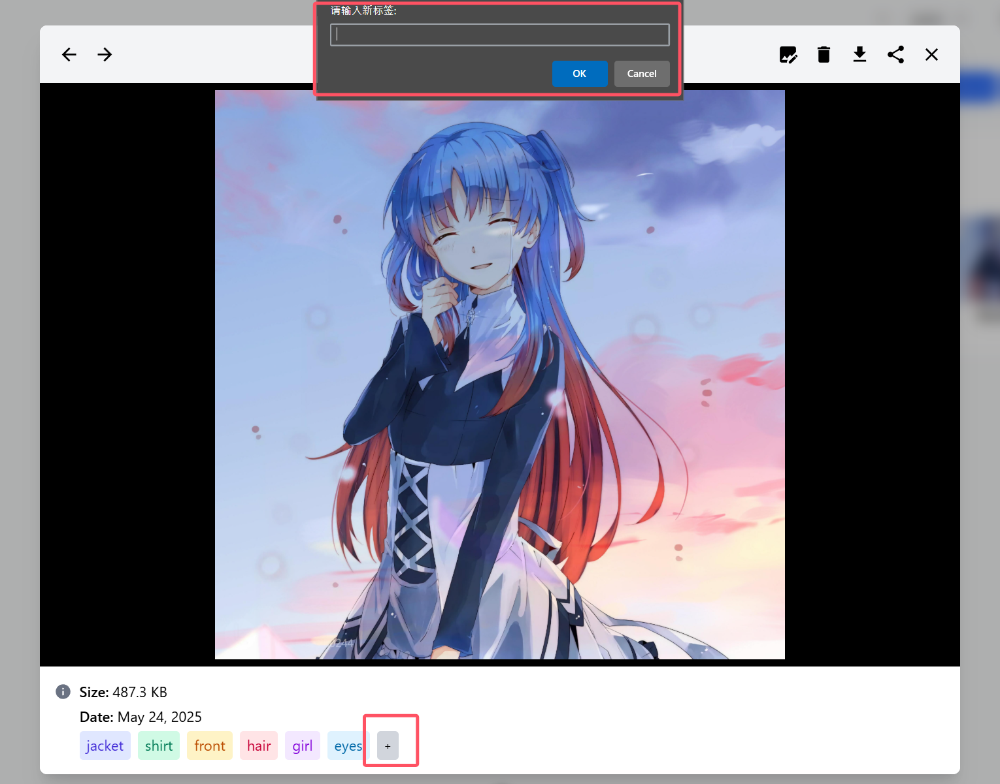
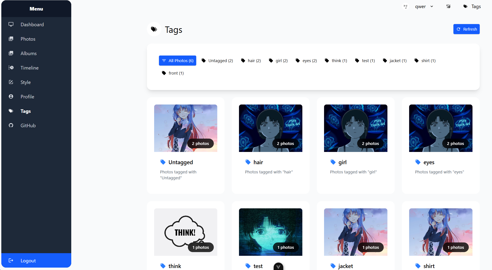

# Smart Album

A modern Vue 3 and Tailwind CSS application for organizing, editing, and managing your photo collections with AI-powered styling capabilities.

## ✨ Features

- **Photo Management**: Upload, organize, and view photos in a beautiful gallery interface
- **Album Organization**: Create and manage photo albums with drag-and-drop functionality
- **Timeline View**: Browse photos chronologically with an intuitive timeline interface
- **AI Photo Styling**: Transform your photos with AI-powered style transfer using Aliyun DashScope
- **Photo Editing**: Built-in photo editor with cropping, filters, and adjustment tools
- **Advanced Search & Filtering**: Powerful search capabilities with multiple filter criteria
- **Tag System**: Organize photos with custom tags for easy searching and filtering
- **Responsive Design**: Works seamlessly on desktop, tablet, and mobile devices
- **User Profiles**: Personal user accounts with secure authentication

## Architecture



## Statistic

### Cyclomatic Complexity
[Javascript Cyclomatic Complexity](./statistic/js-cyclomatic-complexity.json)

### Cloc
```
      91 text files.
classified 91 files
      91 unique files.                              
       0 files ignored.

github.com/AlDanial/cloc v 1.96  T=0.04 s (2424.6 files/s, 225593.6 lines/s)
-------------------------------------------------------------------------------
Language                     files          blank        comment           code
-------------------------------------------------------------------------------
Vuejs Component                 72            863            375           6125
JavaScript                      10             64             64            564
CSS                              9             76              7            329
-------------------------------------------------------------------------------
SUM:                            91           1003            446           7018
-------------------------------------------------------------------------------
```

## 🚀 Quick Start

### Prerequisites

- Node.js (version 16 or higher)
- npm or yarn package manager

### Installation

1. **Clone the repository**

   ```bash
   git clone https://github.com/sustech-cs304/team-project-25spring-9.git
   cd team-project-25spring-9
   ```

2. **Install dependencies**

   ```bash
   npm install
   ```

3. **Start the development server**

   ```bash
   npm run dev
   ```

4. **Open your browser**
   Navigate to `http://localhost:5173` to access the application

### Production Deployment

#### Using Docker

1. **Build the Docker image**

   ```bash
   docker build -t smart-album .
   ```

2. **Run with Docker Compose**
   ```bash
   docker-compose up -d
   ```

#### Manual Build

1. **Build for production**

   ```bash
   npm run build
   ```

2. **Preview the production build**
   ```bash
   npm run preview
   ```

## 📖 User Guide

### Getting Started

1. **Create an Account**

   - Navigate to the registration page
     
   - Fill in your username, email, and password
     
   - Complete the registration process

2. **Login**
   - Use your credentials to access your personal photo library

### Managing Photos

#### Uploading Photos

- Navigate to the **Photos** section
- Click the upload button or drag and drop files into the photo area
- Supported formats: JPG, PNG, GIF, WebP
- Multiple files can be uploaded simultaneously
- Progress indicator shows upload status for each file

#### Deleting Photos

- Select photos using the checkbox selection mode
- Click the delete button in the toolbar
- Confirm deletion in the popup dialog
- **Note**: Deleted photos are permanently removed and cannot be recovered
- Alternatively, right-click on individual photos for quick delete option

#### Downloading Photos

- **Single Photo**: Click on a photo and select the download option
- **Multiple Photos**: Select photos using checkboxes and click the download button
- **Bulk Download**: Selected photos will be packaged into a ZIP file
- Downloads preserve original image quality and metadata
- Large selections may take time to process before download begins



### Advanced Search & Filtering

The Smart Album includes powerful search and filtering capabilities to help you quickly find specific photos in your collection.

#### Quick Search

1. **Basic Text Search**
   - Use the search bar at the top of the Photos section
   - Search by photo name, file type, or any text field
   - Press Enter or click the search button to apply
   - Real-time suggestions appear as you type

#### Advanced Search Panel

1. **Accessing Advanced Search**

   - Click the filter icon next to the search bar
   - The advanced search panel will expand below the search bar
   - Multiple filter criteria can be applied simultaneously

2. **Date Range Filtering**

   - **Start Date**: Select the earliest date for photos to include
   - **End Date**: Select the latest date for photos to include
   - Use date pickers for precise date selection
   - Leave either field empty for open-ended ranges
   - Example: Find all photos from your vacation in July 2024

3. **Location-Based Search**

   - Enter location names, cities, or places
   - Searches through photo location metadata
   - Supports partial matches (e.g., "Paris" will find "Paris, France")
   - Case-insensitive search

4. **Tag-Based Filtering**

   - **Adding Tags**: Type tag names and press Enter or comma
   - **Multiple Tags**: Add multiple tags for more specific searches
   - **Tag Colors**: Each tag gets a unique color for easy identification
   - **Removing Tags**: Click the 'x' on any tag to remove it
   - **Auto-complete**: Suggests existing tags as you type
   - Example: Search for photos tagged with both "family" and "vacation"

5. **People Search**
   - Search for photos containing specific people
   - Enter names or identifiers
   - Useful for finding photos with friends, family members, or colleagues
   - Supports partial name matching

#### Filter Combinations

- **Multiple Criteria**: Use any combination of filters for precise results
- **AND Logic**: All specified criteria must match (photos must meet every condition)
- **Real-time Results**: Photo gallery updates instantly as you apply filters


#### Organizing with Albums

- Go to the **Albums** section
- Create new albums with custom names and descriptions
- Move photos between albums using the selection tools
- Delete albums (photos will be moved to "Unfiled")




#### Using the Timeline

- Access the **Timeline** view to browse photos by date
- Scroll through your photo history chronologically

### Photo Editing

#### Basic Editing

1. Select a photo from any view
2. Click the edit button or double-click the photo
3. Use the built-in editor for:
   - Cropping and resizing
   - Applying filters
   - Adjusting brightness, contrast, and saturation
   - Adding text overlays


#### AI Style Transfer

1. Navigate to the **Style** section
2. Select photos you want to stylize
3. Choose from available AI style presets
4. Process and download your stylized images

### Organizing with Tags

1. **Adding Tags**
   - Select photos in any view
   - Use the tag interface to add descriptive keywords
   - Create custom tag categories



2. **Searching by Tags**
   - Use the search functionality to find photos by tags
   - Filter your photo library using tag combinations



### Advanced Features

#### Batch Operations

- Select multiple photos using the selection mode
- Perform bulk operations:
  - Move to albums
  - Download as ZIP
  - Apply tags
  - Delete photos

#### Download and Export

- Download individual photos or entire albums
- Export photos in original quality
- Batch download selected photos as ZIP files

## 🛠️ Development

### Development Commands

```bash
# Start development server with hot reload
npm run dev

# Build for production
npm run build

# Preview production build
npm run preview

# Run linting
npm run lint

# Format code
npm run format
```

### Technology Stack

- **Frontend Framework**: Vue.js 3 with Composition API
- **Styling**: Tailwind CSS 4
- **Build Tool**: Vite
- **State Management**: Pinia
- **Routing**: Vue Router 4
- **UI Components**: Custom component library
- **Photo Editing**: TUI Image Editor
- **AI Integration**: Aliyun DashScope API

### Project Structure

```
src/
├── components/     # Reusable Vue components
├── views/          # Page components
├── stores/         # Pinia state stores
├── router/         # Vue Router configuration
├── css/            # Stylesheets and Tailwind config
└── layouts/        # Layout components
```

## 🔧 Configuration

### Server Configuration

The application includes nginx configuration for production deployment. The server runs on port 5173 by default and includes SPA fallback routing.

## 🐛 Troubleshooting

### Getting Help

- Check the [GitHub Issues](https://github.com/sustech-cs304/team-project-25spring-9/issues)
- Create a new issue with detailed information about your problem
- Include browser version, operating system, and steps to reproduce
